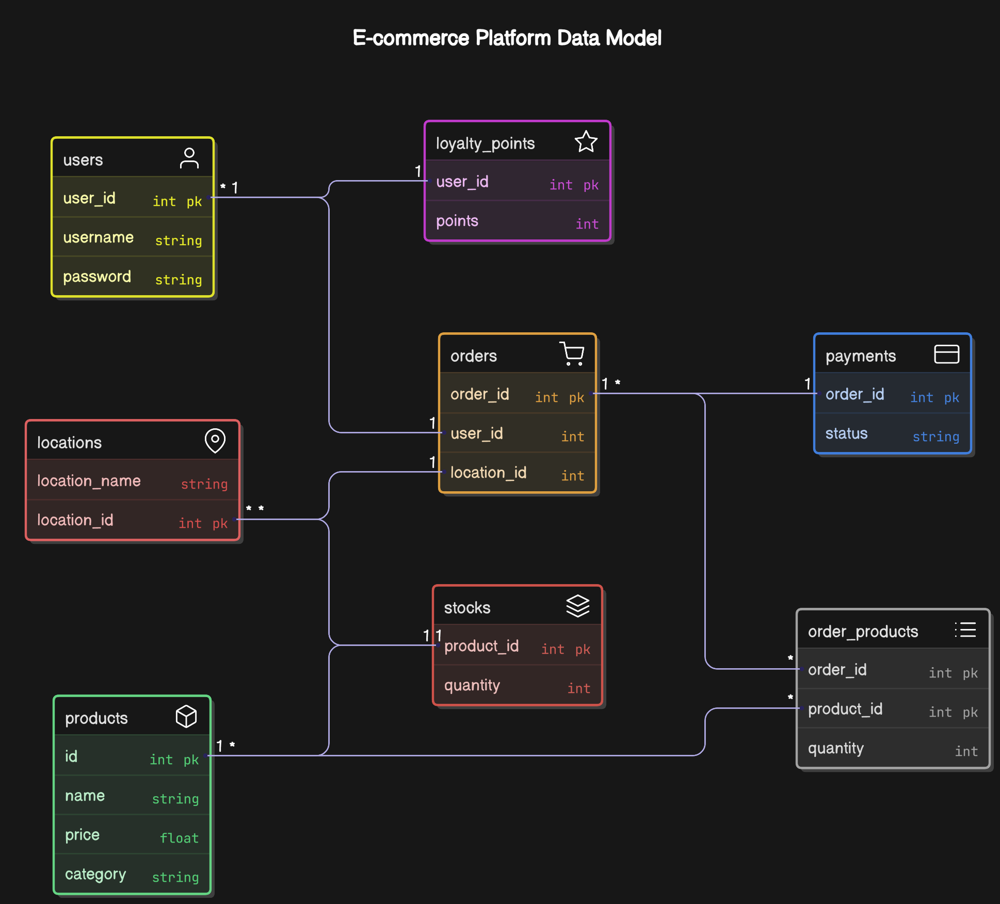

# Lab01-Inkafarma-Software

## Descripción

Este proyecto es una aplicación web desarrollada con **FastAPI** que integra un sistema de mensajería asíncrona mediante **RabbitMQ**. La aplicación ofrece endpoints para:
- Autenticación
- Gestión de productos
- Manejo de stock
- Procesamiento de órdenes
- Pagos
- Fidelidad de clientes (puntos de lealtad)

## Participantes del Proyecto

- **Eros Carhuancho Espejo**
- **Paulo Cuaresma Puclla**
- **Neftalí Calixto Rojas**

---

## Requisitos

- [Docker](https://www.docker.com/) instalado.
- Python 3.8 o superior.
- (Opcional) Git para clonar el repositorio.
- [pytest](https://docs.pytest.org/) para ejecutar los tests (si deseas correr las pruebas unitarias).

---

## Modelo de Datos (ER Diagram)



El diagrama anterior muestra las entidades principales y sus relaciones:

1. **users**: Tabla de usuarios con `user_id`, `username` y `password`.
2. **loyalty_points**: Puntos de fidelidad por `user_id`.
3. **orders**: Contiene la información de las órdenes (`order_id`, `user_id`, `location_id`).
4. **payments**: Pagos asociados a las órdenes (`order_id`, `status`).
5. **locations**: Lugares o sucursales donde se mantiene cierto stock (`location_id`, `location_name`).
6. **stocks**: Stock global de productos (`product_id`, `quantity`).
7. **products**: Catálogo de productos (`id`, `name`, `price`, `category`).
8. **order_products**: Relación de muchos a muchos entre órdenes y productos, incluyendo la `quantity` solicitada.

---

## Endpoints Principales

A continuación, se listan los endpoints expuestos por la API y una breve descripción de su uso:

### Autenticación
1. **POST** `/auth/login`  
   - **Descripción**: Permite iniciar sesión enviando `username`, `password` y `user_id`.  
   - **Retorno**: Mensaje de éxito o error (401 si credenciales inválidas).

### Ubicaciones (Locations)
2. **GET** `/locations`  
   - **Descripción**: Devuelve la lista de todas las ubicaciones disponibles.
3. **GET** `/locations/{location_id}`  
   - **Descripción**: Devuelve la información de una ubicación específica.
4. **GET** `/locations/{location_id}/stock`  
   - **Descripción**: Devuelve el stock completo de una ubicación dada.
5. **GET** `/locations/{location_id}/stock/{product_id}`  
   - **Descripción**: Devuelve la información de stock de un producto específico en la ubicación dada.
6. **GET** `/locations/{location_id}/stock/{product_id}/quantity`  
   - **Descripción**: Devuelve únicamente la cantidad en stock de un producto específico en la ubicación dada.

### Stock Global
7. **GET** `/stock`  
   - **Descripción**: Lista el stock global de todos los productos.
8. **GET** `/stock/{product_id}`  
   - **Descripción**: Devuelve el stock global de un producto específico.
9. **GET** `/stock/{product_id}/quantity`  
   - **Descripción**: Devuelve únicamente la cantidad global en stock de un producto específico.

### Productos
10. **GET** `/products`  
    - **Descripción**: Devuelve la lista de todos los productos en el sistema.
11. **GET** `/products/name/{name}`  
    - **Descripción**: Devuelve los productos que coinciden parcial o totalmente con un nombre.
12. **GET** `/products/category/{category}`  
    - **Descripción**: Lista los productos de una categoría específica.
13. **GET** `/products/category/{category}/id/{product_id}`  
    - **Descripción**: Devuelve un producto de una categoría específica según su ID.
14. **GET** `/products/recomendations/{product_id}`  
    - **Descripción**: Devuelve una lista de productos de la misma categoría que el `product_id` indicado.

### Órdenes
15. **POST** `/orders/create`  
    - **Descripción**: Crea una nueva orden (inserta en `db_orders`) y envía un mensaje a RabbitMQ con los detalles de la orden.
16. **GET** `/orders`  
    - **Descripción**: Lista todas las órdenes registradas en `db_orders`.

### Pagos
17. **POST** `/payments/process`  
    - **Descripción**: Procesa el pago de una orden. Descuenta la cantidad correspondiente del stock global y actualiza el stock en la ubicación asociada (observer pattern).

### Puntos de Lealtad
18. **GET** `/loyalty/{user_id}`  
    - **Descripción**: Devuelve los puntos de lealtad actuales de un usuario.

---

## Flujo General de la Aplicación

1. **Autenticación**: El usuario realiza un `POST /auth/login` con sus credenciales para iniciar sesión.
2. **Consulta de Productos/Stock**:  
   - El usuario puede consultar `/products`, `/stock` o `/locations` para conocer disponibilidad y precios.
3. **Creación de Órdenes**:  
   - Se envía un `POST /orders/create` con los datos de la orden (usuario, productos, cantidades, ubicación).
   - Esto genera un registro en `db_orders` y envía un mensaje a la cola de RabbitMQ.
4. **Procesamiento de Pagos**:  
   - Al llamar `POST /payments/process`, se valida la orden y se descuenta la cantidad correspondiente del stock global.  
   - Se actualiza el stock de la ubicación (`update_location_stock`).
5. **Puntos de Lealtad**:  
   - El usuario puede consultar `/loyalty/{user_id}` para conocer sus puntos acumulados.

---

## Instalación y Configuración

### 1. Clonar el Repositorio

```bash
git clone https://github.com/tu_usuario/Lab01-Inkafarma-Software.git
cd Lab01-Inkafarma-Software
```

### 2. Configurar el Entorno Virtual

1. Crear el entorno virtual:
   ```bash
   python -m venv venv
   ```
2. Activar el entorno virtual:
   - En Windows:
     ```bash
     .\venv\Scripts\activate
     ```
   - En macOS/Linux:
     ```bash
     source venv/bin/activate
     ```
3. Instalar dependencias:
   ```bash
   pip install --upgrade pip
   pip install -r requirements.txt
   ```

---

## Levantar RabbitMQ con Docker

Ejecuta el siguiente comando:

```bash
docker run -d --name rabbitmq -p 5672:5672 -p 15672:15672 rabbitmq:3-management
```

- **-d**: Ejecuta el contenedor en segundo plano.  
- **--name rabbitmq**: Asigna el nombre "rabbitmq" al contenedor.  
- **-p 5672:5672**: Mapea el puerto para conexiones AMQP.  
- **-p 15672:15672**: Mapea el puerto para la interfaz de administración.  
- **rabbitmq:3-management**: Imagen oficial con la interfaz de administración habilitada.

Una vez iniciado, podrás acceder a la interfaz de administración en [http://localhost:15672](http://localhost:15672).  
- Usuario: `guest`  
- Contraseña: `guest`

---

## Ejecutar la Aplicación FastAPI

Asegúrate de tener tu contenedor de RabbitMQ corriendo. Luego, desde la carpeta raíz de tu proyecto:

```bash
uvicorn main:app --reload
```

- La opción `--reload` reinicia automáticamente la aplicación cuando detecta cambios, ideal para desarrollo.
- La aplicación estará disponible en [http://localhost:8000](http://localhost:8000).
- Documentación interactiva de la API en [http://localhost:8000/docs](http://localhost:8000/docs).

---

## Pruebas de la API

El proyecto incluye un archivo de pruebas (por ejemplo, `request.py`) que contiene casos de prueba para verificar el correcto funcionamiento de los endpoints.

### Ejecutar las pruebas

1. Instala `pytest` (si aún no lo tienes):
   ```bash
   pip install pytest
   ```
2. Ejecuta las pruebas:
   ```bash
   pytest -sv request.py
   ```
Se ejecutarán todos los casos de prueba, mostrando los resultados en consola.

---

## Uso y Mantenimiento

- **Detener RabbitMQ**:  
  ```bash
  docker stop rabbitmq
  ```
  Si deseas eliminarlo:
  ```bash
  docker rm rabbitmq
  ```
- **Actualizar la Aplicación**:  
  Cada vez que realices cambios en el código, guarda los cambios, realiza commit y, si es necesario, reinicia Uvicorn (con `--reload` se actualiza automáticamente).

---

## Contribuciones

Las contribuciones son bienvenidas. Por favor, haz un fork del repositorio, realiza tus cambios y envía un pull request describiendo las modificaciones.

---
